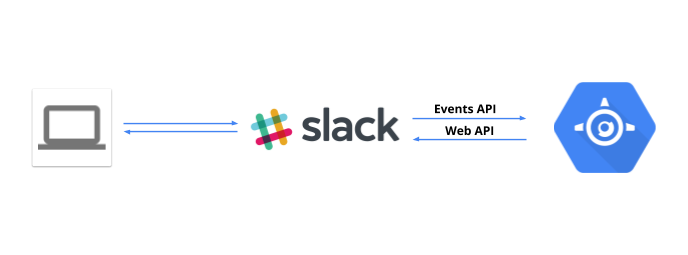

# gae-slack-bot
[Google App Engine](https://cloud.google.com/appengine/) Python [Slack bot](https://api.slack.com/bot-users) example based on [Slack Events API](https://api.slack.com/events-api).

# How it works?

This bot uses [Slack Events API](https://api.slack.com/events-api) to subscribe to selected events and reply via [Slack Web API](https://api.slack.com/web).

# Features

This a proof of concept Slack bot example, which:
* repeats every message in direct conversation or channels to which bot is invited,
* verifies all incoming messages with [Slack verification token](https://api.slack.com/events-api#subscriptions), 
* can run for free within [GCP Free Tier](https://cloud.google.com/free/) if there is a small traffic,
* can automatically scale for larger traffic (requires billing enabled).

# Installation

1. Create a GCP project in [GCP Cloud Console](https://console.cloud.google.com) - see [docs](https://support.google.com/cloud/answer/6251787?hl=en&ref_topic=6158848) for details,
1. Create a Slack app on https://api.slack.com/apps/,
1. Add a bot user for your app,
1. Update bot access token and verification token in [settings.py](settings.py),
1. Install [gcloud](https://cloud.google.com/sdk/docs/) tool,
1. Deploy app using [gcloud app deploy](https://cloud.google.com/sdk/gcloud/reference/app/deploy) command, e.g. 
`gcloud app deploy --version v1 --project your-gcp-project-id app.yaml`
1. Visiting https://your-gcp-project-id.appspot.com page should trigger 'Hello World' message on #general channel. Slack Web API is now working!
1. Subscribe to [message.channels](https://api.slack.com/events/message.channels) and [message.im](https://api.slack.com/events/message.im) event types by providing `https://your-gcp-project-id.appspot.com/slack/event` url - see [docs](https://api.slack.com/events-api#subscriptions) for details 
1. Your bot is now working!

# Development

You can find all development setup in [.travis.yml](.travis.yml)
